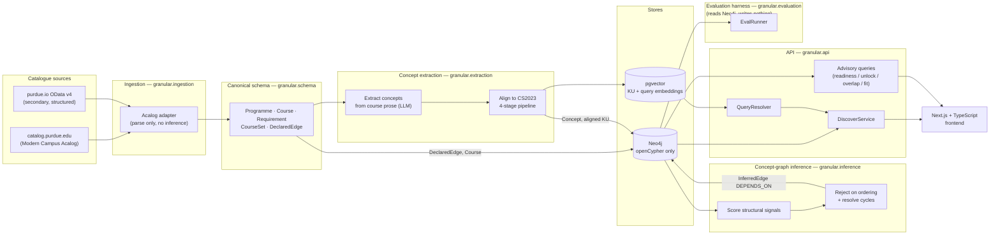
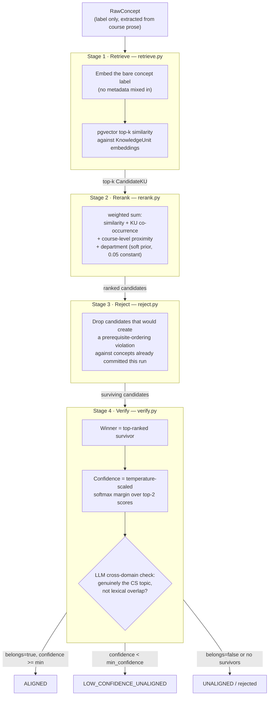
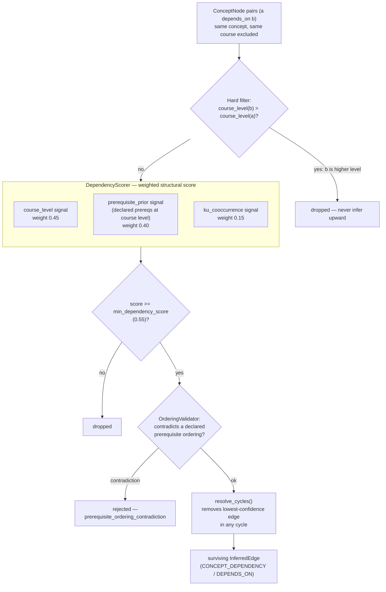
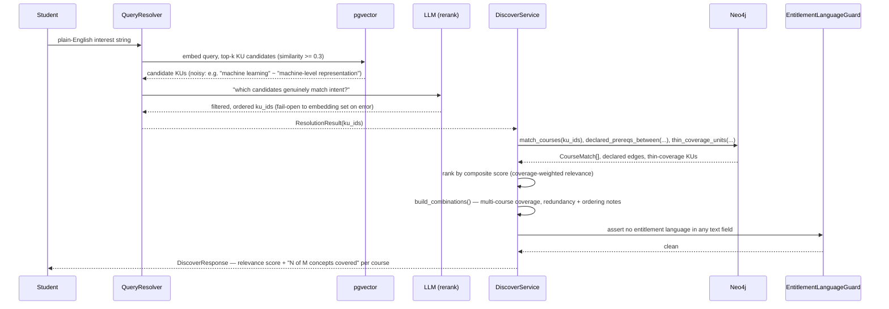
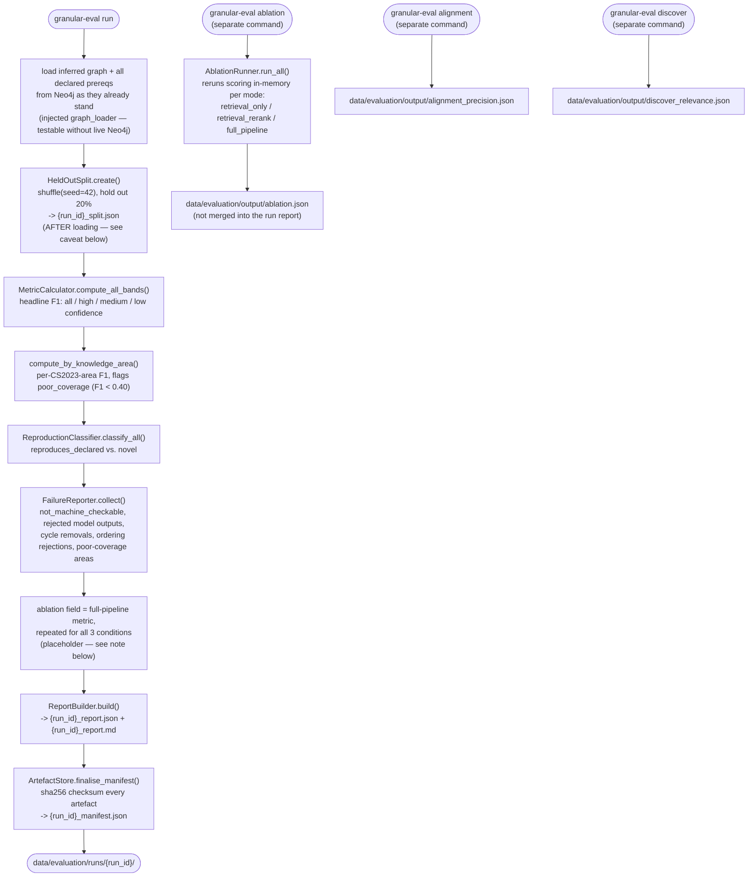
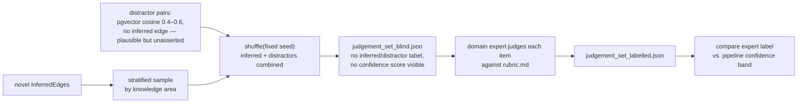

# Granular — System Overview

A research system that ingests Purdue University's published CS curriculum, builds a
two-layer knowledge map, and answers "what should I learn next?" queries in plain
English. See [`project_definition_kiro.md`](project_definition_kiro.md) and
[`.kiro/steering/`](.kiro/steering/) for the source requirements this document
summarises and diagrams.

## The two-layer model

| Layer | What it is | How it's produced | Trust |
| --- | --- | --- | --- |
| **Structural record** | Programmes, courses, requirement rules, declared prerequisites | Deterministic parsing of the catalogue | Auditable to a source URL + retrieval date |
| **Concept graph** | Concepts extracted from course prose, aligned to the CS2023 controlled vocabulary, with inferred dependency edges between them | LLM extraction + embedding alignment + structural inference | Probabilistic — never conflated with declared facts |

**Declared** and **inferred** are separate schema types everywhere in the system; they
cannot appear in the same field of any record (enforced invariant, not a convention).

## End-to-end architecture



Genericity lives entirely at the ingestion adapter boundary — nothing downstream of
the canonical schema knows which institution or platform a record came from.

## Package map

```text
src/granular/
  schema/       Course, Programme, DeclaredEdge, InferredEdge, Concept, KnowledgeUnit,
                ProvenanceRecord, Authority — the types every other package shares
  ingestion/    Acalog adapter, purdue.io client, cs_canonical (CS2023 bootstrap parser)
  extraction/   concept extraction + 4-stage KU alignment pipeline (retrieve/rerank/reject/verify)
  inference/    dependency scoring, ordering validation, cycle resolution -> DEPENDS_ON edges
  api/          FastAPI app: QueryResolver, DiscoverService, advisory-query services
  evaluation/   EvalRunner and every eval described below
apps/web/       Next.js + TypeScript frontend
```

---

## Concept alignment pipeline (extraction)

Each raw concept extracted from a course description is aligned to exactly one
CS2023 knowledge unit (or left unaligned) through four stages, each of which is
only allowed to narrow — never to introduce new candidates:



**Invariant enforced in code:** department is *never* a hard filter — only a
constant +0.05 soft prior in stage 2. `REQ-EH-07` (below) is a standing regression
test that guards this.

The stage-4 LLM verifier (`verify.py::llm_confirms_alignment`) is the guard against
embedding false positives — cases where lexical overlap (e.g. "construction",
"design", "analysis") drags an unrelated concept onto a software-engineering
knowledge unit. It **fails open**: any LLM error or malformed response is treated
as "belongs", so an LLM outage narrows nothing it shouldn't.

---

## Dependency inference pipeline

Runs over the aligned concept set already committed to Neo4j and produces
`DEPENDS_ON` edges between concepts (never embedding similarity alone):



`min_dependency_score` was raised from 0.35 → **0.55** after evaluation showed the
0.40–0.50 confidence band was ~77% of all inferred edges and overwhelmingly false
positive — the higher threshold keeps held-out recall (~0.483) while cutting
false-positive-prone course-pairs roughly 10x. This is a concrete example of the
evaluation harness driving a pipeline change (see the case study below).

---

## Discover (primary advisory surface) query flow



Two metrics per course, never entitlement language: **relevance score** (match
quality) and **coverage breadth** ("8 of 11 concepts").

---

## Evaluation system

The evaluation harness (`granular.evaluation`, CLI: `granular-eval`) exists to make
one honest, reproducible claim about the concept graph's quality — not an
optimistic number. It reads Neo4j; **it never writes to the live graph**. It is no
longer a gate on shipping the advisory surface (that gate was lifted — see
`.kiro/steering/decisions.md`), but it still determines whether the concept graph
is trustworthy enough to *interpret* correctly.

Governing principle from the spec (`requirements.md`): three things are measured
**separately**, deliberately not folded into one number —

1. Held-out declared prerequisites the pipeline can recover (mechanical, no
   hand-labelling)
2. Novel relationships never declared anywhere (blinded expert judgement)
3. Each pipeline stage's individual contribution (ablation)

...plus first-class **failure reporting**: unstructured rules, rejected model
outputs, and poor-coverage subdomains are reported alongside successes, never
hidden.

### Evaluation orchestration

`granular-eval` is five independent commands, not one pipeline. Only `run`
produces a versioned, checksummed artefact directory; the other three each write
a single standalone JSON file to `data/evaluation/output/` and are invoked
separately.



**Known gaps between the original spec and the current implementation** (worth
stating plainly, in the spirit of the project's own "loud failures over silent
degradation" principle):

- **`run`'s ablation numbers are a placeholder, not a measurement.** The report's
  `ablation` section repeats the same full-pipeline `MetricResult` for all three
  conditions — the code comment in `runner.py` is explicit that distinct
  per-condition ablation needs a live pipeline rerun. Real ablation only comes
  from the separate `granular-eval ablation` command (below), and its output isn't
  folded back into the `run` report.
- **`split` is a stub.** `granular-eval split` does not create or persist a split
  file; it prints a message pointing at `run`. `HeldOutSplit.create()` only runs
  as a step inside `run`.
- **No `metric`, `judge`, or `report` command exists**, despite being listed in
  `design.md`. `JudgementSetBuilder` / `JudgementAnalyser` (blinded expert
  judgement, described below) are implemented and unit-tested, but nothing in
  `cli.py` currently invokes them — that track is a usable library component, not
  yet an end-to-end runnable eval.
- **The held-out split is created *after* loading the graph, not before
  inference.** `Neo4jGraphLoader` reads whatever inference already produced and
  wrote to Neo4j — from a `granular-infer` run that had full visibility of *all*
  declared prerequisites (the `prerequisite_prior` signal, 40% of the dependency
  score, is built directly from the full declared-edge set). `EvalRunner.run()`
  then draws the held-out split from that same full set purely to score recall
  after the fact. This is a materially weaker guarantee than REQ-EH-01's
  "withhold before inference, remove from Neo4j, restore after" design: the
  signal that recovers a held-out pair may have seen that exact pair as a
  training input. The headline F1 should be read as "how well does the graph
  reproduce this subset of declared prerequisites," not as a leakage-free
  generalisation test, unless a fresh `granular-infer` run is deliberately
  pointed at a graph built from `split.train` only.

### 1 · Headline metric — prerequisite recovery (`metric.py`)

The one mechanical, non-editorial number. For each **withheld** declared
prerequisite "course X requires course Y":

- **TP** — the inferred `DEPENDS_ON` graph contains a directed concept path from a
  concept in X to a concept in Y (BFS, max depth 5)
- **FN** — no such path exists
- **FP** — an inferred course-pair path that isn't backed by *any* declared
  prerequisite (held-out or not)

Reported as precision/recall/F1, sliced four ways every time: **all edges**, and by
confidence band (**high ≥ 0.70**, **medium 0.40–0.69**, **low < 0.40**) — plus a
breakdown **per CS2023 knowledge area**, with areas below the poor-coverage
threshold (F1 < 0.40, configurable) flagged explicitly. Aggregate-only reporting is
disallowed by the spec (`REQ-EH-02`).

### 2 · Reproduction vs. novel contribution (`reproduction.py`)

Every inferred edge is classified `reproduces_declared` (a declared prerequisite
already exists for that course pair) or `novel` (it doesn't). Both are reported
with confidence distributions — `reproduces_declared` edges are explicitly barred
from being presented as evidence of the pipeline's contribution (`REQ-EH-03`);
only `novel` edges can make that claim, and only after expert judgement.

### 3 · Blinded expert judgement of novel edges (`judge.py`)

> **Implementation status:** `JudgementSetBuilder` and `JudgementAnalyser` are
> fully implemented and unit-tested, and `ReportBuilder.to_markdown()` already
> accepts an optional `JudgementReport` to render the "Expert Judgement" section
> when one exists. But no `granular-eval` command currently builds the blind set,
> writes `rubric.md`, or loads a labelled set back in — this track has to be
> driven directly through the Python API today, not the CLI.



Rubric (written *before* any judgement is recorded, per item: `correct` /
`plausible_but_wrong` / `incorrect`), so the expert never knows which items are the
system's own claims versus plausible-but-unasserted distractors.

### 4 · Ablation (`ablation.py`, run via `granular-eval ablation`)

Reruns dependency inference **in-memory** under three progressively richer signal
sets, against the identical held-out split. This is a separate command from
`run` — it takes minutes (a real rescoring pass per mode) and writes its own
`data/evaluation/output/ablation.json`, distinct from the placeholder ablation
numbers `run` puts in its report (see the orchestration caveats above):

| Condition | Signals used |
| --- | --- |
| `retrieval_only` | course-level structural signal alone |
| `retrieval_rerank` | + prerequisite-prior + KU co-occurrence signals |
| `full_pipeline` | + ordering rejection + cycle resolution |

Two eval-driven correctness fixes live here (commit `fe89591`):

- **Fair per-mode threshold.** `min_dependency_score` (0.55) is tuned for the
  *combined* score. Applied unchanged to `retrieval_only` — whose course-level
  signal alone realistically maxes ~0.4 — it rejected everything and made the
  condition uninformative. The threshold is now scaled by
  `signal_weights.course_level` for that mode, so each ablation condition answers
  a fair "what can this signal set recover on its own" question.
- **Documented non-bug.** `full_pipeline` and `retrieval_rerank` frequently report
  *identical* metrics. This is expected: the dependency inferrer hard-filters any
  candidate where the dependency is at a higher course level than the dependent,
  so inferred edges are already level-monotonic and structurally can't form the
  cycles or ordering contradictions that stage 3/4 exist to remove. The rejection
  stage is correct but redundant given that upstream filter — it only starts
  earning its keep if the hard filter is ever loosened. The eval surfaced this
  rather than hiding it.

### 5 · Alignment precision (`alignment_eval.py`, run via `granular-eval alignment`) — added by `feat/quality-evals`

The metrics above evaluate the **dependency graph**. This one evaluates the layer
underneath it — the **concept → CS2023 alignment** — because a wrong alignment can
still produce a structurally plausible dependency edge. Written specifically to
catch what an F1-on-edges metric cannot: alignments that are lexically plausible
but topically wrong (the class of bug that motivated it: *"solar car
construction" aligned to "Software Construction"*).

- Stratified sample of aligned concepts across knowledge areas (fixed seed)
- An `LLMAlignmentJudge` asks: does this concept genuinely belong to this
  knowledge unit, or is it surface-word overlap?
- Reports precision overall and per knowledge area

This eval is what drove the stage-4 verifier prompt rewrite in the same
eval-driven-fixes commit — see the case study below.

### 6 · Discover relevance (`discover_eval.py`, run via `granular-eval discover`) — added by `feat/quality-evals`

Evaluates the **advisory surface itself**, not just the graph underneath it: for
18 hand-labelled plain-English queries (`data/evaluation/discover_labels.json`,
e.g. `"machine learning" → {IS}`, `"databases and SQL" → {IM}`), resolve the query
through the real `QueryResolver` and compare the **knowledge areas** reached
against the expected areas (areas, not specific KU ids, because areas are stable
across CS2023 vocabulary revisions). Reports per-query and macro
precision/recall/F1.

### 7 · Failure reporting (`failure.py`)

Every run reports, **always**, even when the count is zero:

- prerequisite rules that couldn't be structured (`not_machine_checkable`)
- model outputs rejected by validation
- inferred edges removed for cycle prevention
- inferred edges rejected for prerequisite-ordering contradiction
- knowledge areas below the poor-coverage F1 threshold

### 8 · Department hard-filter regression test (`REQ-EH-07`)

A standing pytest case (`tests/evaluation/test_department_filter.py`, marked
`@pytest.mark.regression`): find a cross-listed CS course, rerank its candidates
with and without the department signal zeroed out, and assert the top-ranked
candidate doesn't change. It runs as part of the normal test suite (`pytest` /
`hatch run test`) — it is **not** currently invoked by, or wired into the exit
code of, `granular-eval` itself, despite `REQ-EH-07`'s "SHALL cause the harness to
exit with a non-zero code" wording. It is still the regression guard that stops
the soft prior in stage 2 of the alignment pipeline from silently becoming a hard
filter again; it just gates CI/test runs rather than eval runs today.

### Scope statement, artefacts, reproducibility

Every report opens with a **machine-generated** scope statement (institution,
discipline, catalogue year, ingestion run id) ending in a fixed caveat: *the
genericity claim covers adapter genericity across the Modern Campus platform, not
extraction genericity across disciplines.* It is templated from `EvalConfig`, never
hand-written, so it can't drift from what was actually evaluated.

Every `run` writes a versioned directory
(`data/evaluation/runs/{run_id}/{run_id}_split.json`,
`{run_id}_report.json`, `{run_id}_report_md.md`, `{run_id}_manifest.json` with a
sha256 checksum per artefact), so results are comparable across pipeline versions
and the held-out split can never be quietly re-rolled to improve a number. The
`ablation` / `alignment` / `discover` commands are not part of this versioning —
they overwrite a single fixed filename in `data/evaluation/output/` each time
they run.

### Case study: the evaluation loop closing a real gap

Commit sequence `729e379` → `d8eb632` → `fe89591`:

1. `729e379` added the alignment-precision, discover-relevance, and real-ablation
   evals (`feat/quality-evals`).
2. Running them surfaced two concrete problems: the stage-4 verifier was
   accepting cross-domain lexical matches (electrical-engineering "antenna /
   signal transmission" passing as CS "Networking and Communication"; optics
   concepts passing as "Graphics and Interactive Techniques"; pure statistics
   passing as "Algorithms and Complexity"), and the ablation's shared threshold
   made `retrieval_only` structurally unable to pass anything.
3. `fe89591` fixed both at the source: the verifier prompt in
   `extraction/pipeline/verify.py` now enumerates the specific adjacent-discipline
   confusions to reject, and `evaluation/ablation.py` scales the acceptance
   threshold per ablation mode.

This is the harness doing its designed job: not producing a single flattering
number, but a comparison that locates a specific, fixable defect.

---

## CLI surface

```text
granular-ingest   # ingestion adapters
granular-extract  # concept extraction + CS2023 alignment
granular-infer    # dependency inference (supports --mode for ablation)
granular-eval run | ablation | alignment | discover | split
```

As implemented today (`src/granular/evaluation/cli.py`) — this differs from
`design.md`'s original `run | split | metric | judge | report` table:
`ablation`, `alignment`, and `discover` were added by `feat/quality-evals` and
`split` is currently a stub (see the orchestration caveats above).

## Enforced invariants (recap)

1. Provenance (source URL, retrieval timestamp, adapter name/version) on every record
2. Declared and inferred facts are separate types, never merged in one field
3. Concepts produced by a model record the model identifier
4. Minted identifiers carry `authority: derived` unless genuinely institution-issued
5. Unstructured requirements retain verbatim source text, never silently dropped
6. No learner/achievement type — completed-course lists are session-scoped, never persisted, never returned in an answer
7. No entitlement language in any advisory answer (enforced by `EntitlementLanguageGuard`)
